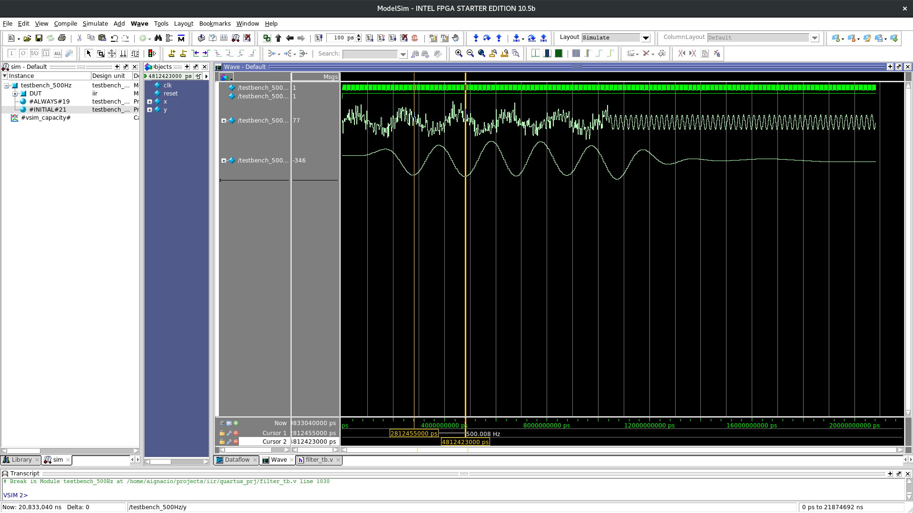

# Discrete-Time IIR Filter (lowpass - real) #
-------------------------------

** Developer: ** Ânderson I. Silva

** Repository: ** https://github.com/aignacio/iir_filter

** Parameters: **
* Fs : 48000 Samples/s
* Fc : 1000 Hz
* Fs : 1500 Hz
* Apass: 1dB
* Astop: -15dB
* Filter Structure    : Direct-Form I, Second-Order Sections
* Architecture: Cascade
* Number of Sections  : 3
* Stable              : Yes
* Linear Phase        : No
* Arithmetic          : fixed

** Design Method Information **
* Design Algorithm : butter

** Design Options **
* Match Exactly : stopband
* Scale Norm    : no scaling
* SystemObject  : false

** Design Specifications **
* Sample Rate     : N/A (normalized frequency)
* Response        : Lowpass
* Specification   : Fp,Fst,Ap,Ast
* Stopband Atten. : 15 dB
* Passband Ripple : 1 dB
* Stopband Edge   : 0.0625
* Passband Edge   : 0.041667

** Measurements **
* Sample Rate      : N/A (normalized frequency)
* Passband Edge    : 0.041667
* 3-dB Point       : 0.047064
* 6-dB Point       : 0.051568
* Stopband Edge    : 0.0625
* Passband Ripple  : 0.89022 dB
* Stopband Atten.  : 14.9855 dB
* Transition Width : 0.020833
